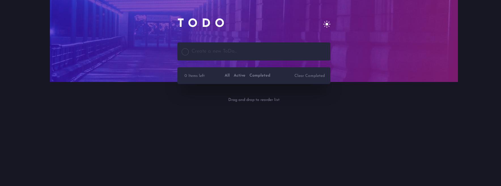
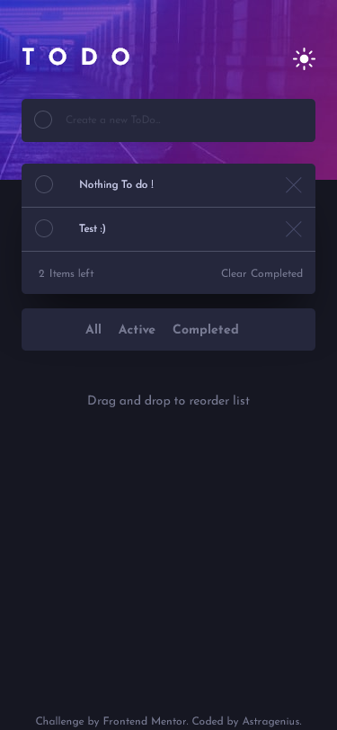

# Frontend Mentor - Todo app solution

This is a solution to the [Todo app challenge on Frontend Mentor](https://www.frontendmentor.io/challenges/todo-app-Su1_KokOW). Frontend Mentor challenges help you improve your coding skills by building realistic projects. 

## Table of contents

- [Overview](#overview)
  - [The challenge](#the-challenge)
  - [Screenshot](#screenshot)
  - [Links](#links)
- [My process](#my-process)
  - [Built with](#built-with)
  - [Useful resources](#useful-resources)
- [Author](#author)
- [Acknowledgments](#acknowledgments)

## Overview

### The challenge

Users should be able to:

- View the optimal layout for the app depending on their device's screen size
- See hover states for all interactive elements on the page
- Add new todos to the list
- Mark todos as complete
- Delete todos from the list
- Filter by all/active/complete todos
- Clear all completed todos
- Toggle light and dark mode
- Drag and drop to reorder items on the list

### Dark Mode

### Light Mode

### Mobile Version

  

### Link

- Live Site URL: [To-Do-App - Vercel](https://to-do-app-virid.vercel.app/)

## My process

### Built with

- Semantic HTML5 markup
- CSS custom properties
- Flexbox
- SCSS

### Useful resources that i used during the Challange.
#### Rounded checkboxes
A good rescource for Styling checkboxes
- [SVG inside](https://codepen.io/rolchau/pen/rlAtq/)
- [CSS Tricks](https://css-tricks.com/fun-times-styling-checkbox-states/)
#### Drag and drop

- [web.dev](https://web.dev/drag-and-drop/)
#### Animation for List items

- [Codepen](https://codepen.io/donovanh/pen/wBRNyE) 
- [Css Animation](https://cssanimation.rocks/list-items/)
- [more Animations](https://www.sarasoueidan.com/demos/creative-list-effects/index-6)

## Author

- Frontend Mentor - [@astragenius](https://www.frontendmentor.io/profile/astragenius)
